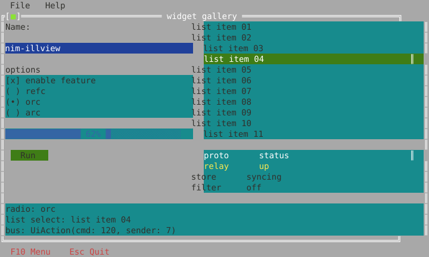
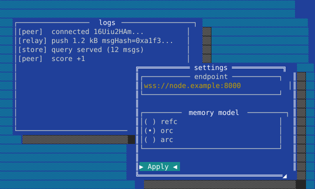
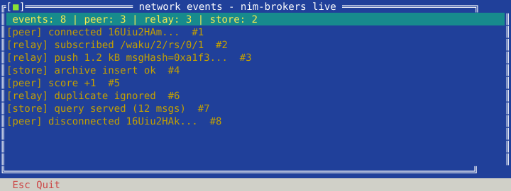
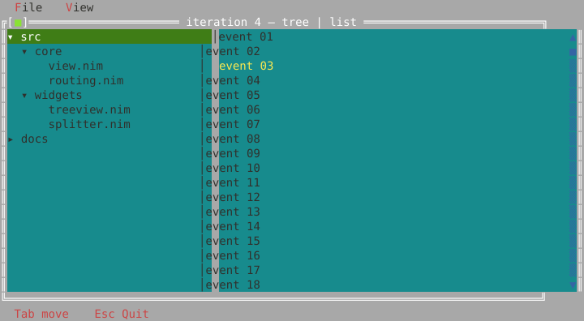
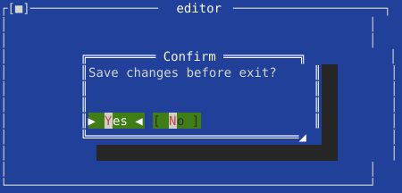

# illview

**A retained-mode, TurboVision-inspired TUI widget framework for Nim** — windows,
menus, tables and forms on a single-threaded [chronos](https://github.com/status-im/nim-chronos)
event loop, with a declarative macro DSL and [nim-brokers](https://github.com/NagyZoltanPeter/nim-brokers)
as the typed event bus.

 
 



*Every "screenshot" in this README is generated by the framework itself,
rendered off-screen cell-for-cell into SVG (`nimble screenshots`).*

## Why illview

- **Retained view tree** over [illwill](https://github.com/johnnovak/illwill)'s
  double-buffered terminal diffing — you compose widgets, the framework draws.
- **One thread, zero idle cost.** Everything lives on a single chronos loop.
  Input arrives via `addReader` (no polling), rendering is dirty-driven and
  fps-capped, and an idle app has *no pending timers at all* — measured
  0.00 CPU over an idle run. Built for embedding a live UI into an async
  daemon without taxing it.
- **Framework-owned input routing.** Mouse = z-order hit-test with capture
  (dragging); keys = focus + bubble; Tab/Shift-Tab traversal; modal scopes.
  Widgets never subscribe to input.
- **Declarative UI**: describe a screen as a pragma-annotated type, `mount(T)`
  builds and wires it — layout, captions, styling, handlers, state binding
  and typed broker events included.
- **Fully off-screen testable**: 106 unit tests run without a terminal, from
  the escape-sequence decoder to pixel-exact render snapshots.

## Quick start

```sh
nimble install https://github.com/NagyZoltanPeter/nim-illview
```

```nim
import chronos
import illview

proc main() {.async.} =
  let app = newApp()

  let win = newWindow("hello", rect(10, 3, 40, 12))
  win.shadow = true
  let box = newVBox(spacing = 1)
  box.dock = dkFill
  box.add newLabel("Hello from illview!")
  let btn = newButton("Click me")
  btn.onClick = proc(b: Button) {.gcsafe, raises: [].} =
    b.caption = "Clicked!"
    b.invalidate()
  box.add btn
  win.add box
  app.desktop.add win

  app.onInput = proc(ev: InputEvent) {.gcsafe, raises: [].} =
    if ev.kind == ikKey and ev.key == Key.Escape:
      app.stop()

  await app.run()

waitFor main()
```

Tab moves focus, Enter/Space activates, the mouse just works (click, wheel,
drag the title bar to move the window, drag the `◢` corner to resize —
or Alt+Arrows / Alt+Shift+Arrows).



## Declarative UI, state binding, typed events

Describe the screen as a type; `mount(T)` builds the tree and wires
everything. Plain fields become live state (`bindValue`), and widget
actions can emit **typed, auto-generated nim-brokers events** (`emits` +
`uiEvents`):

```nim
import chronos
import illview
import illview/dsl/uievents

type
  LoginForm {.view, vbox, spacing: 1.} = ref object of Group
    user {.child, bindValue: "userVal".}: Input
    pass {.child, bindValue: "passVal", border: bkSingle,
           boxTitle: "secret".}: Input
    remember {.child, caption: "remember me",
               bindValue: "rememberVal".}: Checkbox
    login {.child, caption: "Login", emits: "LoginRequested",
            bindTo: "onLogin".}: Button
    userVal, passVal: string
    rememberVal: bool

uiEvents(LoginForm) # generates the LoginRequested broker event + emitter

proc onLogin(self: LoginForm, sender: Button) {.gcsafe, raises: [].} =
  discard # self.userVal / self.passVal are already current here

let form = mount(LoginForm)

# anywhere else in the program — typed, decoupled:
discard LoginRequested.listen(
  proc(ev: LoginRequested): Future[void] {.async: (raises: []), gcsafe.} =
    echo "login requested by widget ", ev.senderId)
```

Want validation without coupling the widget to the storage? Route the
update through a replaceable **RequestBroker** provider instead:

```nim
port {.child, bindValue: "portVal", bindRequest: "SetPort".}: Input
```

```nim
discard SetPort.replaceProvider(DefaultBrokerContext,
  proc(value: string): Result[string, string] =
    if value.allCharsInSet({'0'..'9'}): ok(value) # or normalize it
    else: err("not a number"))                    # veto: field unchanged
```

## Communication model: instance-ctx events & signals

Every widget instance owns a **BrokerContext** — identity lives in the
route, not the payload. The framework vocabulary (`illview/vocab`) defines
the event/signal types ONCE; two buttons share the `Clicked` type but can
never cross-talk, because each listener is bucketed under one widget's ctx:

```nim
type
  ConnectForm {.view, vbox.} = ref object of Group
    host {.child, bindValue: "hostVal",
           on: {TextChanged: "onHostEdit", Submitted: "onHostDone"}.}: Input
    prog {.child.}: ProgressBar
    run    {.child, caption: "Run",   on: {Clicked: "onRun"}.}: Button
    cancel {.child, caption: "Reset", on: {Clicked: "onReset"}.}: Button
    hostVal: string

uiEvents(ConnectForm)

proc onRun(self: ConnectForm) {.gcsafe, raises: [].} = discard
proc onHostEdit(self: ConnectForm, ev: TextChanged) {.gcsafe, raises: [].} =
  discard # typed payload; ev.text
```

The reverse direction is a **SignalBroker** per directive — single handler
per (type, ctx) = exactly the mounted widget. The model drives widgets it
never imports, holding nothing but a ctx (a plain value, safe after
dispose — signals just return `err`):

```nim
# async driver: stops by itself when the widget disappears
for pct in countup(0, 100, 5):
  if SetProgress.signal(form.prog.brokerCtx, SetProgress(value: pct)).isErr:
    return
  await sleepAsync(60.milliseconds)

form.setHostVal("10.0.0.1")   # D10 writer: store field + SetText signal
discard FocusMe.signal(form.run.brokerCtx)
```

| Direction | Mechanism | Declarative form |
|-----------|-----------|------------------|
| widget → form proc | vocab event on the widget's ctx | `on: {Clicked: "onRun"}` |
| widget → view field | slot store (+ optional validation) | `bindValue` / `bindRequest` |
| form → widget value | Set-signal on the widget's ctx | `form.setHostVal(v)` (generated) |
| widget → model, semantic | app-defined event, default ctx | `emits: "RunRequested"` |
| model → widget, decoupled | Set-signal via a stored ctx handle | wiring-time ctx handoff |

Guidance: models listen **semantic by default** (`RunRequested` survives UI
restructuring); instance-ctx listening is the escape hatch for genuinely
widget-bound concerns (mirroring, metrics). Lifecycle: broker registrations
hold strong refs — call `dispose(view)` exactly once when a subtree is
permanently done (teardown + ctx recycling; `remove()` alone keeps wiring
alive on purpose). See `examples/ex10_instance_ctx.nim` for two instances
of one form living side by side.

## Live domain events

Domain events fan out through the bus (exact or `prefix/*` wildcard topics)
— the bundled `NetVizWidget` turns them into a live feed with zero input
plumbing of its own:

```nim
import illview/bus_brokers

app.bus = newBrokersBus()
discard app.bus.subscribeDomain("relay/*",
  proc(topic, payload: string) {.gcsafe, raises: [].} =
    nv.addEvent(topic, payload))

# from your node / daemon code, same chronos loop:
app.bus.publishDomain("relay/push", "1.2 kB msgHash=0xa1f3...")
```



## Styling

Borders, titles, shadows and colors are per-view properties (drawn by the
framework, honored by hit-testing), themable via tokens, and available as
pragmas:

```nim
endpoint {.child, border: bkSingle, boxTitle: "endpoint".}: Input
warn {.child, caption: "careful!", fg: fgRed, bg: bgGreen.}: Label
hot {.child, focusFg: fgBlack, focusBg: bgYellow.}: Input
```

or imperatively: `w.border = bkDouble`, `w.shadow = true`,
`w.styleOv.fg = fgCyan`, subtree themes via `w.theme`.

## Widgets

| | |
| --- | --- |
| Containers | `Desktop`, `Window` (move/resize, close/zoom, tile/cascade), `GroupBox`, `HBox`/`VBox`/`Grid`, `FormLayout`, `Splitter`, `Scroller`, dock anchors + `align`/`anchors`/`padding` |
| Controls | `Label` (hotkey `linkTo`), `Button`, `Checkbox`, `Radio`, `Input` (validators + history), `Editor` (multiline) |
| Data | `ListView`, `Table` (header + column size hints), `TreeView` (lazy), `TextView` (capped log), `ProgressBar`, `ScrollBar`, `NetVizWidget` |
| Chrome | `MenuBar` + nested dropdowns + `~tilde~` accelerators, `StatusBar`, stock dialogs (`messageBox`/`confirm`/`inputBox`), command enable/disable |





Every interactive widget has typed closure slots (`onClick`, `onChange`,
`onSubmit`, `onFocus`/`onBlur`, …) fired synchronously inside dispatch, plus
an optional broker `command`. Alt+letter accelerators (`~R~un`), a per-key
`Input.filter` (`digitsOnly`, `maxLen`, `charSet`, `intRange`), and app-wide
`enableCommand`/`disableCommand` greying round out the interaction model.

## Architecture in five lines

1. Vendored illwill is the "hardware layer": `TerminalBuffer` + diffed `display()`.
2. A pure, incremental **escape-sequence decoder** feeds a chronos `addReader`
   stdin driver (dedicated tty fd; SIGWINCH via self-pipe). POSIX only for now.
3. `frame()` is blocking and single-shot: arrange → draw (clipped
   `DrawContext`) → display. Scheduled on demand, capped at `fpsCap`.
4. Routing delivers content-local coords; parents draw child decoration
   (border/title/shadow), so drawing and hit-testing can never disagree.
5. Handlers mutate state, call `invalidate()`, and the next frame shows it.

Details: [docs/DESIGN.md](docs/DESIGN.md) · build plan
[1](docs/BUILD-PLAN.md) · [2](docs/BUILD-PLAN-2.md) ·
[3](docs/BUILD-PLAN-3.md) · [4](docs/BUILD-PLAN-4.md) ·
[deviations & gotchas](docs/DESIGN-DEVIATIONS.md) ·
[Windows driver (deferred)](docs/WINDOWS-DRIVER.md)

## Documentation

- [docs/REFERENCE.md](docs/REFERENCE.md) — the full option surface: every
  pragma, every widget with its slots / vocab events / signals, generated
  artifacts, lifecycle, bus tiers, layout, styling.
- [docs/COOKBOOK.md](docs/COOKBOOK.md) — copy-paste recipes: forms,
  two-way binding, validation, driving widgets from async model code,
  focus, testing patterns, custom widgets.

## Examples

```sh
nimble examples   # builds all of these into build/examples/
```

| | |
| --- | --- |
| `ex00_echo`, `ex01_loop` | input pipeline, dirty-driven loop, TUI on/off toggle |
| `ex02_windows` | overlapping windows, click-to-raise, drag move/resize |
| `ex03_layout` | boxes/grid/dock reflowing live on terminal resize |
| `ex04_widgets_gallery` | every widget, slots wired, bus commands |
| `ex05_declarative` | the gallery rebuilt with pragmas + `mount` |
| `ex06_netviz` | live network events through real nim-brokers |
| `ex07_styling` | borders, shadows, color & focus overrides |
| `ex09_bindings` | `bindValue`/`bindRequest`/`emits` round trip |
| `ex10_instance_ctx` | instance-ctx events & signals: two forms, one event type, zero cross-talk |
| `ex11_scroller` | `Scroller` viewport + synced `ScrollBar`, focus auto-scroll |
| `ex12_splitter` | draggable `Splitter` dividing a list and a log |

## Development

```sh
nimble test          # 106 tests, no terminal required
nimble examples      # build all demos into build/examples/
nimble screenshots   # regenerate docs/assets/*.svg
```

Requires Nim ≥ 2.0 (`--mm:orc`). Depends on `chronos` and `brokers` only;
illwill is vendored (single file, WTFPL, provenance header kept).

## License

MIT. The vendored `illwill` is WTFPL by John Novak.
