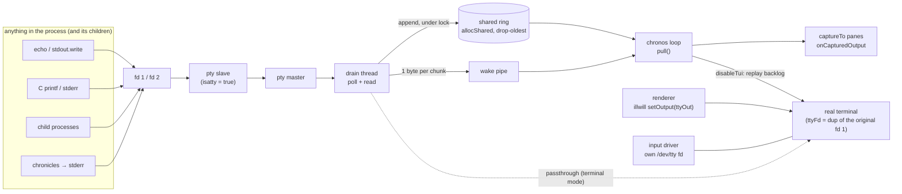
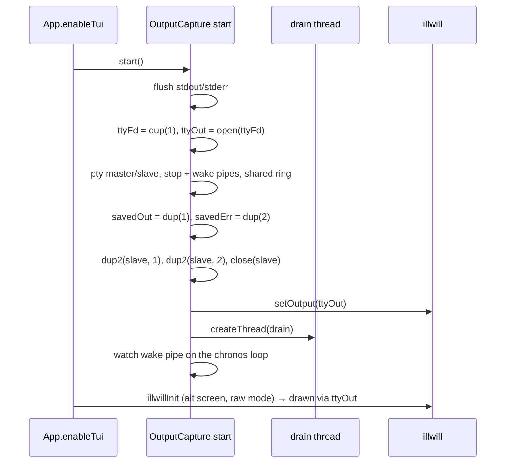
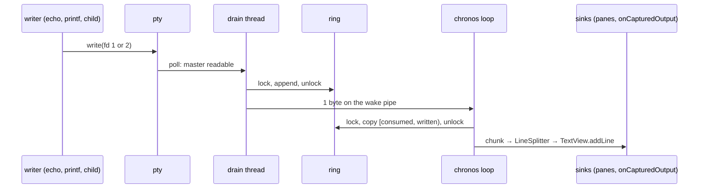
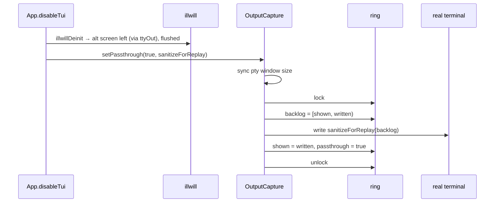
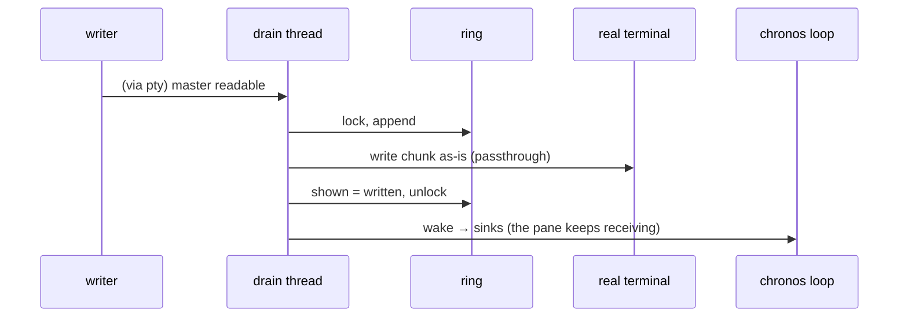

# Output capture: keeping stdout/stderr while the TUI is up

While illview's desktop is on screen it owns the terminal's alternate screen.
Anything else that writes to fd 1 or fd 2 — your own `echo`, a C library's
`printf`, a child process, a logger pointed at stderr — would land on that
screen too: it garbles the UI until the next repaint and is gone when the
alternate screen is left. Output capture collects that output instead, shows
it in a pane if you want, and hands it back to the terminal's normal
scrollback when you leave the desktop. Design record: deviation #41 in
[DESIGN-DEVIATIONS.md](DESIGN-DEVIATIONS.md).

## 1. Using it

```nim
let app = newApp(captureOutput = true)  # opt-in; default off
let pane = newTextView(maxLines = 500)
app.captureTo(pane)                     # optional: live, one line per captured line
app.onCapturedOutput = proc(chunk: string) {.gcsafe, raises: [].} =
  discard                               # optional: raw bytes as they arrive
app.captureLimit = 4 shl 20             # optional: history kept for replay (default 1 MiB)
await app.run()
```

| Call | Effect |
|---|---|
| `newApp(captureOutput = true)` / `app.captureOutput = true` (before `run`) | capture starts with the first `enableTui()` and ends when `run` returns |
| `app.captureTo(tv)` | feeds captured output into `tv` line by line, escape sequences stripped; several panes may be attached |
| `app.onCapturedOutput` | raw captured chunks, on the loop thread |
| `app.capturedOutput()` | captured bytes not yet shown on the real terminal |
| `app.captureLimit` | ring size in bytes; oldest output is dropped beyond it |
| `app.disableTui()` | leave the desktop: replay the backlog into the scrollback, then pass output through live |
| `app.enableTui()` | back to the desktop: collect again |
| `CaptureSupported` (const) | `true` on POSIX builds with threads; elsewhere the option is a no-op |

`examples/ex14_logpane.nim` is the reference: F2 leaves the desktop (terminal
mode), Enter returns, Esc quits; a chronicles logger and plain stdout/stderr
writes show up both in the pane and in the scrollback, whichever mode printed
them.

## 2. Architecture



Three facts drive the design:

- **The renderer must not write to fd 1.** fd 1 now feeds the capture. The
  vendored illwill carries a local patch (`setOutput` / `output()`): every
  terminal write — the cell writer, cursor positioning (`setCursorPos`,
  `setCursorXPos`), colours, alternate-screen and mouse switches, flushes —
  goes to one handle, which capture points at a dup of the real terminal.
  Missing even one call is visible: when `setCursorXPos` still went to stdout,
  the diff renderer's sideways jumps went into the capture and text was drawn
  shifted left.
- **A pty, not a pipe.** Programs check `isatty(1)`: through a pipe they drop
  colours and C stdio switches to full buffering (late, reordered output). The
  pty keeps them behaving exactly as on a terminal.
- **A drain thread, not the loop.** A pty holds very little before a writer
  blocks — measured **1024 bytes on macOS** (Linux ~4 KiB; a pipe 64 KiB). If
  the chronos loop were the reader, one larger synchronous write *from the
  loop thread itself* would block forever. A small internal thread reads the
  pty continuously, so writers never wait on the loop.

## 3. Components and ownership

| Resource | Created | Owned by | Released | Notes |
|---|---|---|---|---|
| `ttyFd` / `ttyOut` (dup of the original fd 1) | `start()` | `OutputCapture` | `stop()` (closing `ttyOut` closes the fd) | renderer output, replay and passthrough target |
| `savedOut`, `savedErr` (dups of fd 1, fd 2) | `start()` | `OutputCapture` | `stop()` | restored over fd 1/2 by `stop()` and by the crash handler |
| pty master | `start()` (`posix_openpt`, `grantpt`, `unlockpt`) | shared state | `stop()` | read only by the drain thread |
| pty slave | `start()`, then `dup2` over fd 1/2 and closed | fd 1/2 (and inherited by children) | when fd 1/2 are restored and children exit | window size synced on resize and when passthrough starts |
| shared state + ring | `start()`: `createShared` / `allocShared0` | shared by thread and loop, behind a `Lock` | next `start()` or `dispose()` | plain memory, no GC types: identical under refc and ORC |
| drain thread | `start()`: `createThread` | `OutputCapture` | `stop()`: stop-pipe byte → final non-blocking sweep → `joinThread` | touches only the shared state and fds |
| wake pipe | `start()` | thread writes, loop reads (chronos `addReader2`) | `stop()` | non-blocking; a full pipe just means the loop is already awake |
| stop pipe | `start()` | loop writes, thread polls | `stop()` | lets the thread exit even if children still hold the pty |

Positions in the ring are absolute byte counters: `written` (total stored),
`shown` (already on the real terminal), and the loop's `consumed` (already
handed to the sinks). Bytes older than `written - limit` have been dropped.

## 4. Flows

### 4.1 Start: first `enableTui()`



### 4.2 Desktop mode: a write



Nothing reaches the real terminal; the desktop stays intact.

### 4.3 Leaving the desktop: `disableTui()` (F2)



Replay and the switch to passthrough happen under one lock hold: the drain
thread cannot slip a new chunk in between, so nothing is lost and nothing
appears twice.

### 4.4 Terminal mode: a write



fd 1/2 stay on the pty, so programs keep seeing a terminal (`isatty` true).

### 4.5 Back to the desktop: `enableTui()` (Enter)

`setPassthrough(false)`, then `illwillInit`. From now on output is collected
again; the screen is repainted in full (deviation #40).

### 4.6 Exit: `run` returns

`disableTui()` (replay + passthrough, as in 4.3), then `stop()`: flush, `dup2`
the saved fds back over fd 1/2, a byte on the stop pipe, the thread drains
what is left without blocking and exits, `joinThread`, final `pull()` to the
sinks, `setOutput(stdout)`, close everything; `dispose()` frees the ring.

### 4.7 Crash (SIGSEGV, SIGABRT, SIGBUS, SIGILL, SIGFPE)

The terminal-restore handler (`installCrashRestore`, deviation #31) runs:

1. `captureCrashFds()` — `dup2(savedOut, 1)`, `dup2(savedErr, 2)` (async-signal-safe);
2. write the restore sequence (mouse off, paste off, cursor on, leave the
   alternate screen, reset attributes) — now to the real terminal;
3. restore the cooked termios;
4. `captureCrashDump()` — `write(2)` of the not-yet-shown ring bytes, raw, no
   allocation, no lock (best effort), on the main screen so it stays visible;
5. chain to the previously installed handler.

## 5. Guarantees and limits

| Property | How |
|---|---|
| stdout and stderr stay in order relative to each other | one pty for both fds |
| No line lost or shown twice across mode switches | absolute `shown` mark; replay + passthrough switch under one lock |
| Writers never block on the UI | the drain thread reads continuously; tested with a single 200 KB write from the loop thread |
| Bounded memory | ring of `captureLimit` bytes, drop-oldest (the newest output wins) |
| Pane and scrollback both complete | capture stays on in terminal mode; pane sinks see every chunk |
| UI never garbled by foreign output | nothing captured reaches the terminal while the desktop is up |

Replay sanitising (`sanitizeForReplay`) — what is kept when the backlog is
written to the scrollback:

| Kept | Stripped |
|---|---|
| text, `\n`, `\r`, `\t` | cursor movement and positioning (`CSI A–H`, …) |
| SGR colour and style (`ESC[…m`) | screen/line clears (`CSI J/K`), scroll regions |
| | mode switches incl. alternate screen and cursor visibility (`CSI ?…h/l`) |
| | OSC (window titles, hyperlinks), charset designations, other two-byte escapes, BEL and other C0 controls |

Passthrough in terminal mode writes captured bytes as-is (like a normal
terminal would show them). Panes get `stripAnsi` text: no escapes, no `\r`.

## 6. Platform and memory-model support

| | refc | ORC | Reason |
|---|---|---|---|
| macOS | ✅ | ✅ | POSIX pty (`posix_openpt`) + `createThread`; the thread uses no GC memory, so both collectors behave the same |
| Linux | ✅ | ✅ | same; pty buffer larger (~4 KiB) but the design does not depend on it |
| Windows | — (no-op) | — (no-op) | the Windows input driver is deferred (deviation #18); no pty/fd model to redirect |
| any, `--threads:off` | — (no-op) | — (no-op) | the drain thread is required (`CaptureSupported` = POSIX and threads) |

## 7. Caveats

- **Default off.** Without `captureOutput`, fd 1/2 and `isatty(1)` are never
  touched.
- **Interactive children in terminal mode** still have fd 1/2 on the pty; a
  program that needs to *read* the terminal (an editor, a pager) is not the
  use case — run those with the TUI fully stopped.
- **Loggers**: with capture on, the simplest setup is to let them write to
  stderr like any other code — one path feeds both the pane and the
  scrollback (ex14). Writing the same record to a pane directly *and* to
  stderr shows it twice in the pane.
- **New renderer code must write through `output()`**, never `stdout`
  (see §2).
- **The terminal must support the alternate screen** for the desktop/terminal
  split to look right; illwill currently enables it only for `TERM` values
  `xterm-256color` / `xterm-color`.

## 8. Testing

- `tests/test_capture.nim`: replay sanitiser, `stripAnsi`, line splitter;
  stdout/stderr captured in order; drop-oldest; a write far beyond the pty
  buffer; restart; passthrough (backlog once, then live, pane sees all).
- Real-terminal checks (python `pty.fork()` harness, as in deviations
  #37/#40/#41): no captured bytes on screen in desktop mode; pane and
  scrollback complete over F2/Enter round trips; the crash path restores the
  terminal and prints the tail.
